# 👋 Welcome to LumenPass

> **Hello, and welcome.** Thanks for stopping by the LumenPass repository — we're glad you're here. Whether you're evaluating a password manager, exploring our docs, or just curious about how we keep your secrets safe, this README will get you up and running in minutes.

---

# LumenPass — Password Manager

  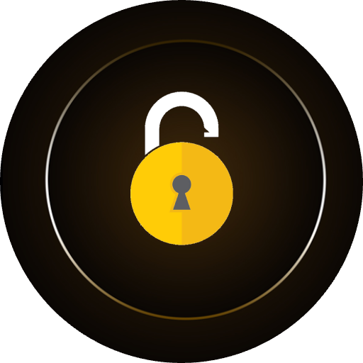

**Secure access, simplified.**

A premium, privacy-first password manager that keeps your logins, passkeys, credit cards, secure notes, and TOTP codes inside one encrypted vault you control.

[Website](https://lumenpass.app) · [Download](https://www.lumenpass.app/downloads) · [Pricing](https://www.lumenpass.app/pricing) · [Privacy](https://lumenpass.app/policy) · [Terms](https://www.lumenpass.app/terms)

---

## Overview

LumenPass is built for people who want strong security without friction. Save once, sign in anywhere — with one-tap AutoFill, biometric unlock (Face ID / Touch ID / Windows Hello), and end-to-end encryption that puts privacy first.

Whether you're an individual safeguarding personal accounts, a freelancer juggling client logins, or a family sharing access safely, LumenPass keeps every credential, secret, and identity organized inside a vault only you can open.

> **Zero-knowledge by design.** Your master password never leaves your device. We can't see your data — and neither can anyone else.

---

## Key Features

### 🔐 Encrypted Vault for Everything
- **Logins & passwords** with auto-generated, strong, unique credentials
- **Passkeys** for passwordless, phishing-resistant sign-in
- **Credit & debit cards** stored securely for fast checkout
- **Secure notes** for recovery codes, software licenses, and private memos
- **Identities** to autofill addresses, phone numbers, and personal info
- **TOTP / 2FA codes** built in — no second authenticator app needed

### ⚡ Effortless Sign-In
- **One-tap AutoFill** across browsers, apps, and websites
- **Browser extensions** for Chrome, Edge, Firefox, Safari, and Brave
- **Cross-device sync** keeps every device in lockstep
- **Biometric unlock** with Face ID, Touch ID, fingerprint, or Windows Hello

### 🛡️ Security You Can Trust
- **End-to-end encryption** with AES-256 and modern key derivation
- **Zero-knowledge architecture** — your master password is never transmitted or stored
- **Open vault format** based on the proven KDBX standard
- **Local-first storage** with optional encrypted cloud sync
- **Breach monitoring** alerts you if a saved credential appears in a known leak

### 📱 Works Everywhere You Do
- **Desktop:** Windows, macOS, Linux
- **Mobile:** iOS and Android
- **Web & Browser Extensions:** Chrome, Edge, Firefox, Safari, Brave

---

## Why LumenPass?

- **Privacy-first:** No tracking, no profiling, no data harvesting
- **Beautifully simple:** A clean, modern interface that gets out of your way
- **Built for trust:** Auditable, transparent, and honest about how your data is handled
- **Fair pricing:** Generous free tier and a no-risk 30-day premium trial

---

## Free License

LumenPass ships with a generous **Free plan** — **$0 forever**, no trial timer, no credit card, no nag screens.

**Included free, forever:**

- ✅ **Unlimited items** of every type — logins, passkeys, TOTP codes, secure notes, identities, bank accounts, credit cards, and SSH keys
- ✅ **Unlimited devices** across macOS, Windows, Linux, iOS, and Android
- ✅ **All browser extensions** — Chrome, Edge, Firefox, and Safari
- ✅ **1 vault / database** in the proven KeePass-compatible KDBX format
- ✅ **Master Password & Keyfile** unlock
- ✅ **Categories** to organize your vault
- ✅ **Automatic backup** of your encrypted database
- ✅ **Local-first storage** with optional sync via **Google Drive** or **Dropbox**
- ✅ **Continuous updates** to the latest version

> Need PIN or biometric unlock, multiple vaults, more cloud providers, or an SSH agent? See the [Pricing page](https://www.lumenpass.app/pricing) for plan details.

---

## 30-Day Premium Trial

Try the **full LumenPass Premium experience free for 30 days** — **no credit card required** to start. At the end of the trial your account automatically converts back to the Free tier unless you choose to subscribe.

**Premium unlocks everything in Free, plus:**

- 🚀 **Unlimited vaults / databases** for separating personal, work, and shared secrets
- 🔢 **PIN Unlock** for fast access on trusted devices
- 🧬 **Biometric Unlock** — Face ID, Touch ID, Windows Hello, and fingerprint
- 🔑 **SSH Agent** integration for developers
- ☁️ **More cloud storage providers** — OneDrive, WebDAV, SFTP, and S3-compatible storage (in addition to Google Drive and Dropbox)
- 🌟 **Early access** to new features as they ship
- 🛟 **Premium Support** from the LumenPass team

> **No credit card required.** Start your trial from the [Downloads page](https://www.lumenpass.app/downloads). Cancel anytime — keep access until the end of your billing period and downgrade to the Free plan without losing any saved data.

**Pricing at a glance:**

| Plan | Price | Highlights |
| --- | --- | --- |
| **Free** | **$0 forever** | Unlimited items, unlimited devices, 1 vault, Google Drive & Dropbox sync |
| **Premium (Yearly)** | **$15.99 / year** (≈ $1.33 / month) | Everything in Free + unlimited vaults, PIN & Biometric unlock, SSH Agent, more cloud storages, early-access features, Premium Support |
| **Premium Lifetime** | **$79 once** | Everything in Premium, no recurring payment, lifetime updates |

See the full feature comparison on the [Pricing page](https://www.lumenpass.app/pricing).

---

## Get Started

1. **Download** LumenPass for your platform from the [official downloads page](https://www.lumenpass.app/downloads).
2. **Create your vault** and choose a strong, memorable master password.
3. **Import** existing logins from your browser or another password manager.
4. **Install the browser extension** for one-tap AutoFill on the web.
5. **Sign in everywhere** — let LumenPass do the typing for you.

---

## Resources

| Resource | Link |
| --- | --- |
| Main website | [lumenpass.app](https://lumenpass.app) |
| Download apps | [www.lumenpass.app/downloads](https://www.lumenpass.app/downloads) |
| Pricing & plans | [www.lumenpass.app/pricing](https://www.lumenpass.app/pricing) |
| Privacy policy | [lumenpass.app/policy](https://lumenpass.app/policy) |
| Terms of service | [www.lumenpass.app/terms](https://www.lumenpass.app/terms) |

---

## Screenshots

A look at LumenPass across desktop and mobile.

### 🖥️ Desktop

The full LumenPass desktop experience — vault overview, item editor, generator, and security tools.

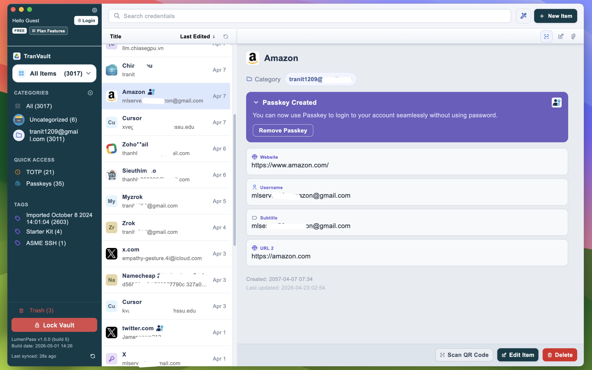

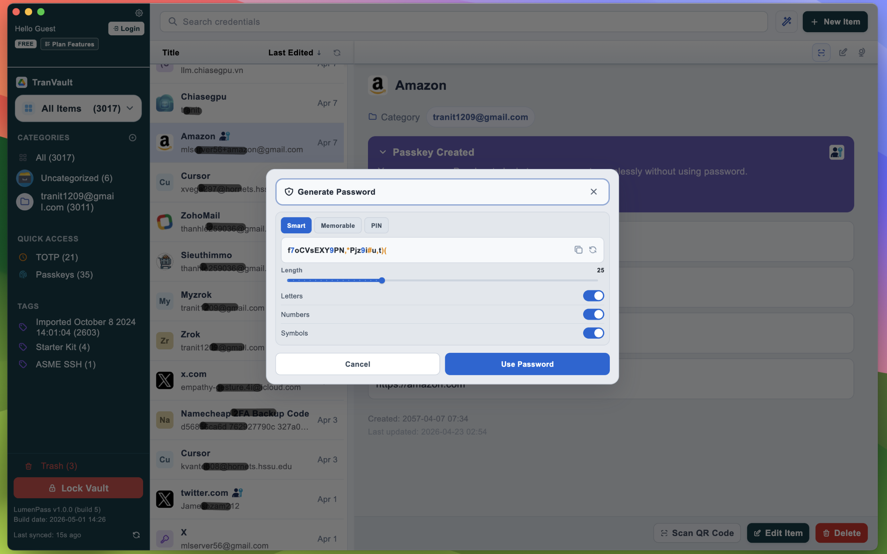

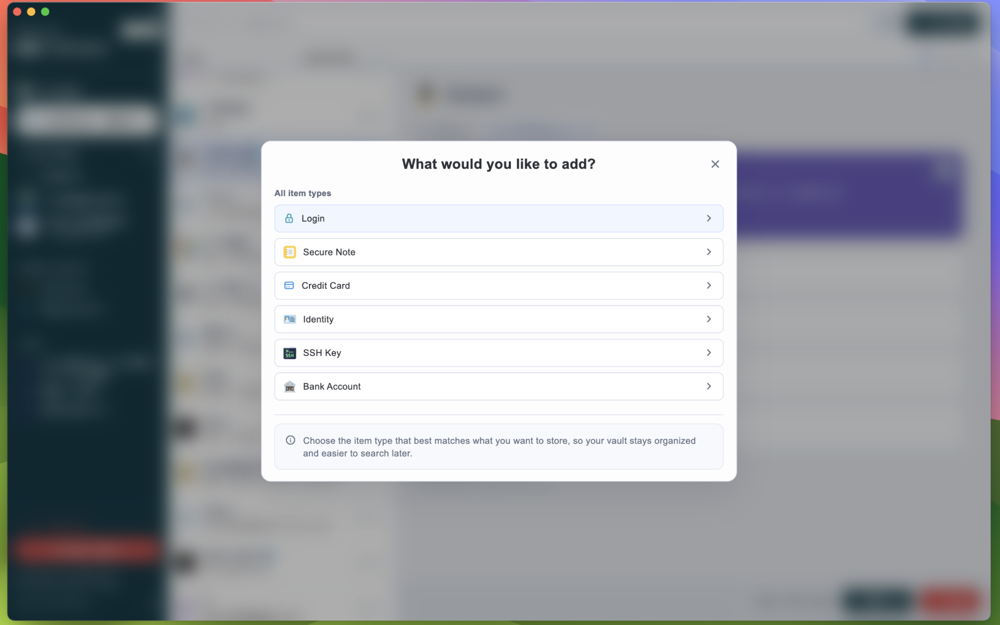

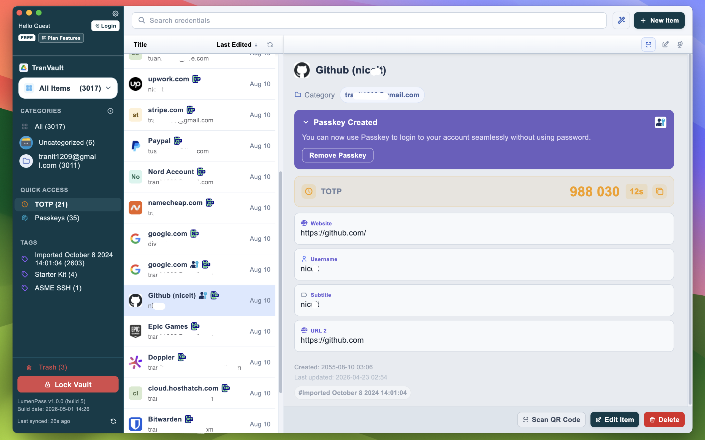

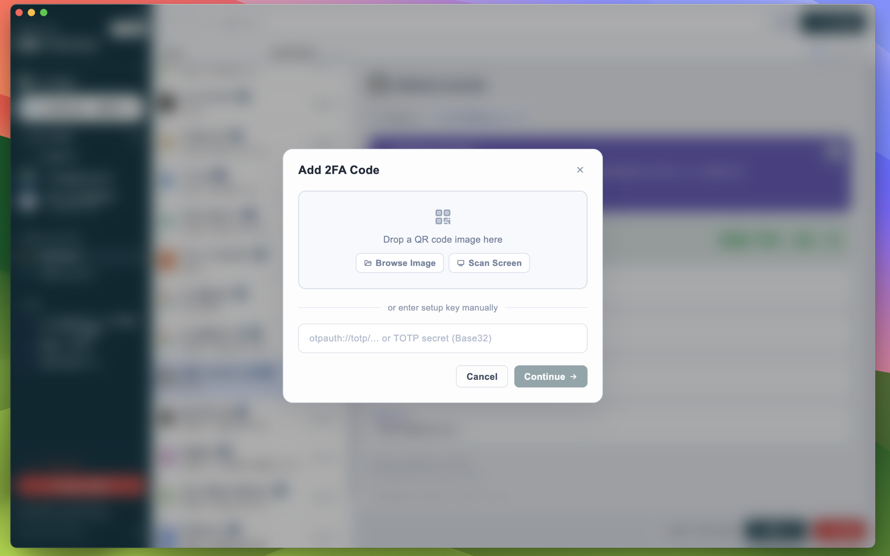

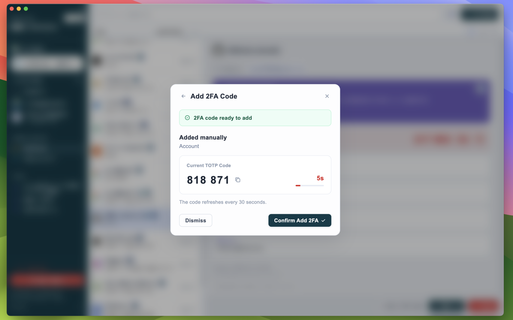

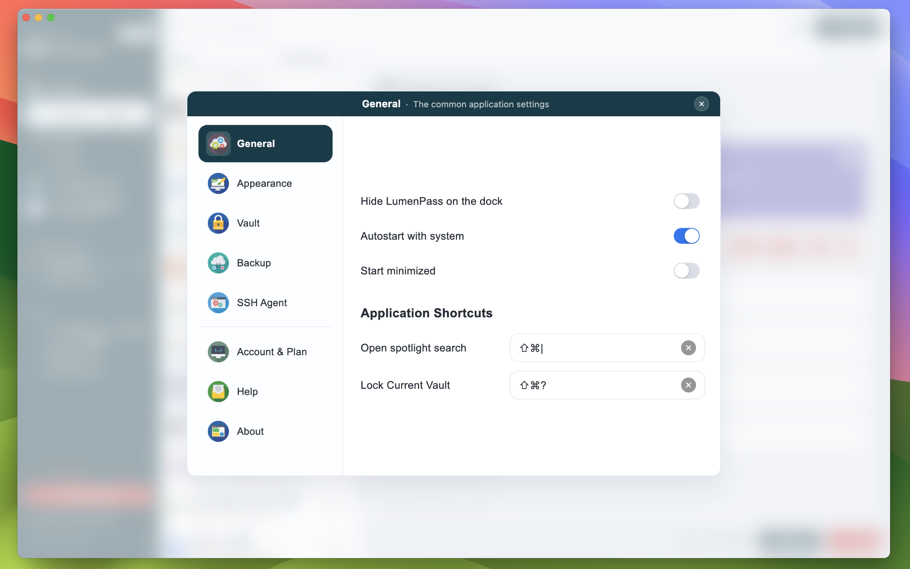

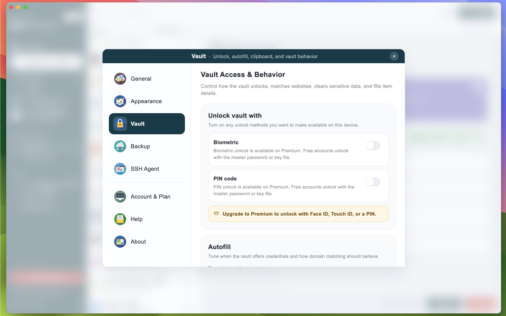

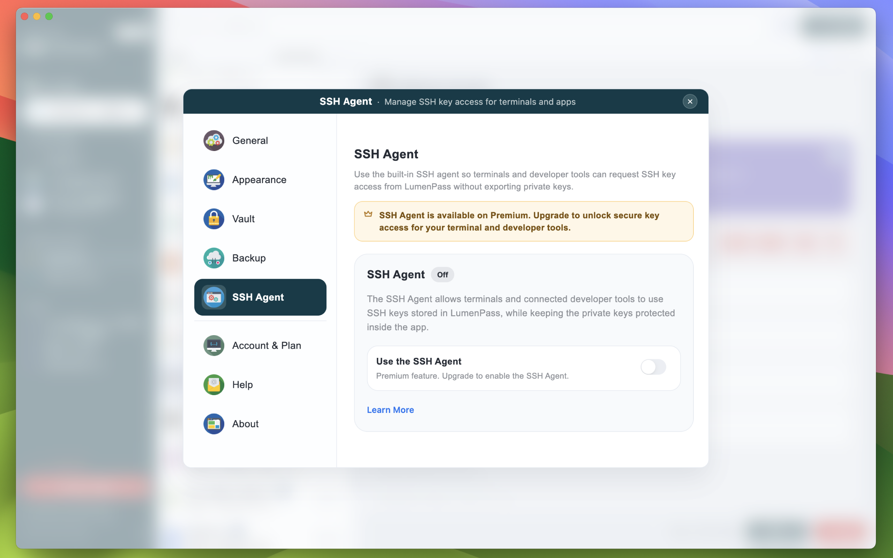

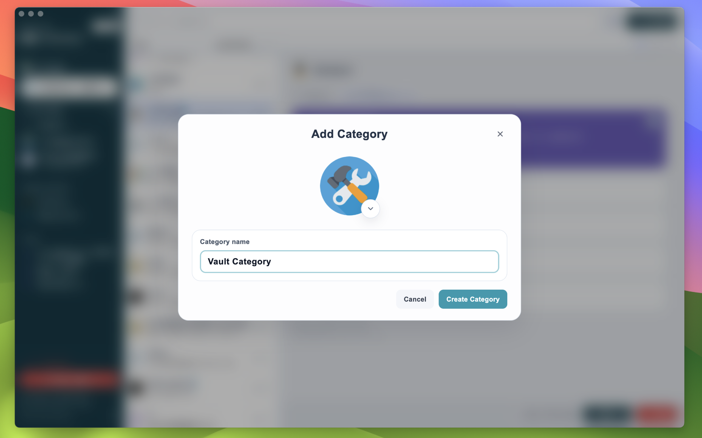

### 📱 Mobile

Responsive, touch-first design with biometric unlock and one-tap AutoFill on the go.

       

### 🧩 Browser Extension

Sign in with one click on any site you visit.

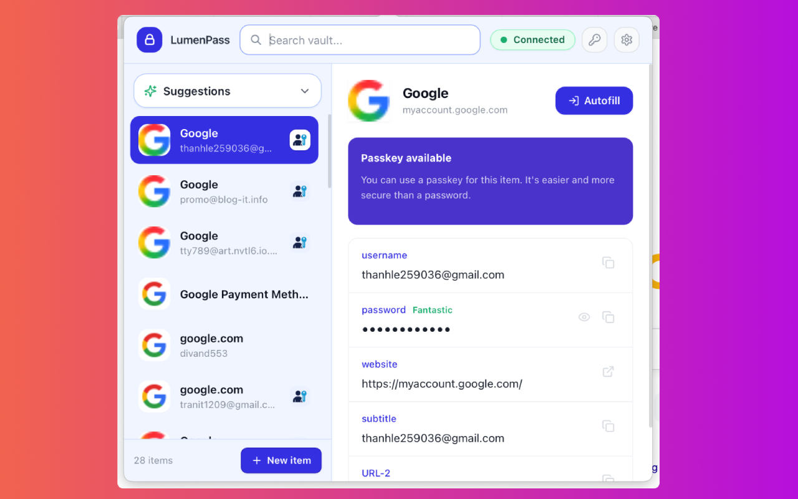 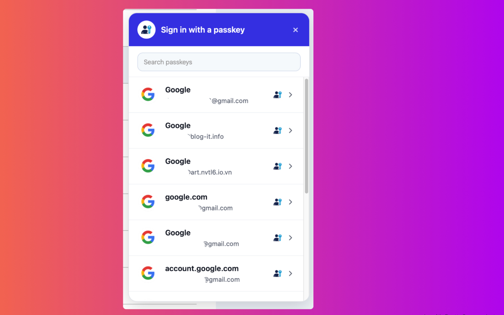 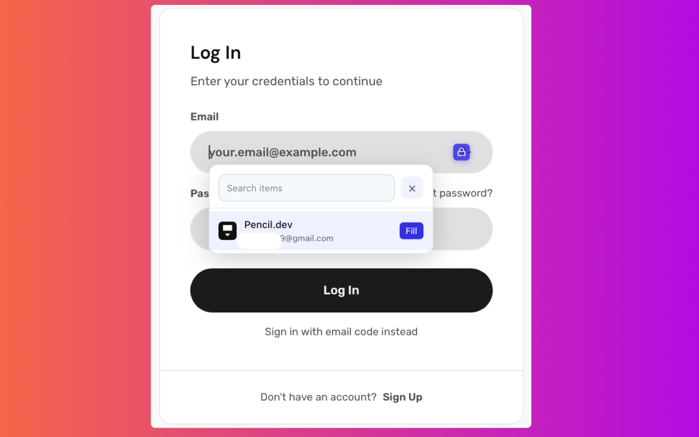 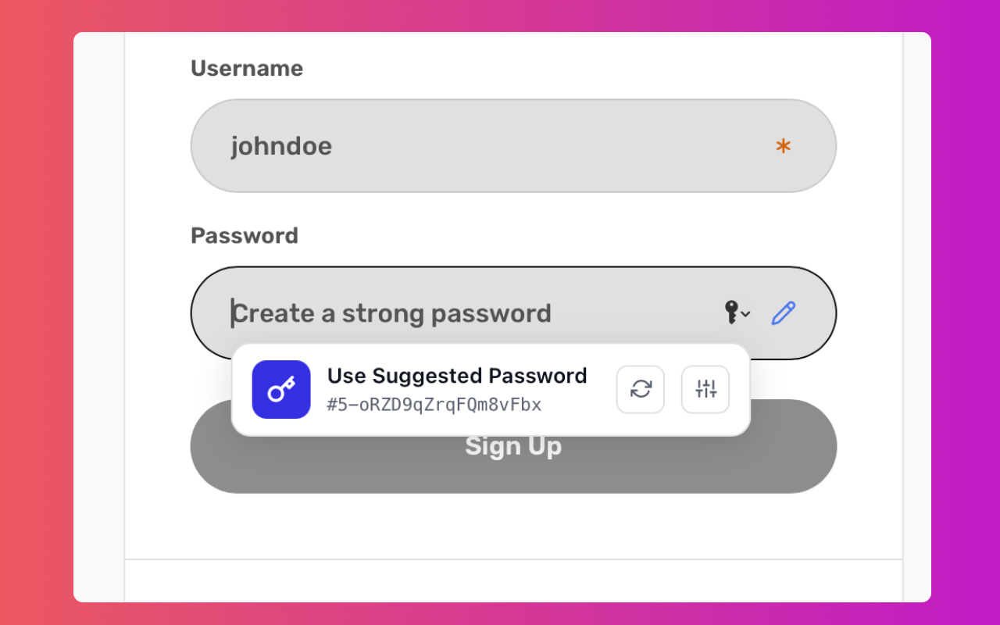 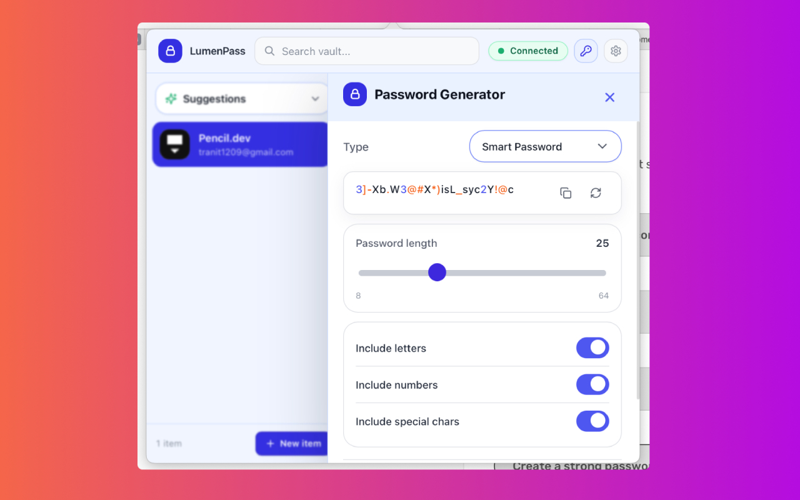

---

**LumenPass — Secure access, simplified.**

[Get LumenPass](https://www.lumenpass.app/downloads) · [Visit lumenpass.app](https://lumenpass.app) · [Read the Privacy Policy](https://lumenpass.app/policy) · [Terms of Service](https://www.lumenpass.app/terms)
